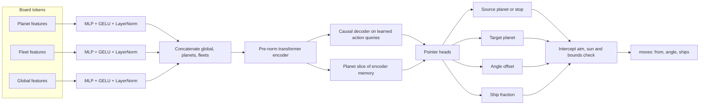

# orbit_warsv2

Behaviour cloning for [Orbit Wars](https://www.kaggle.com/competitions/orbit-wars): a set transformer reads the board and imitates winners. This is the PyTorch successor to the JAX PPO agent in [azxav/orbit_wars](https://github.com/azxav/orbit_wars).

## Pitch

Orbit Wars is a 2- or 4-player real-time strategy game on a 100×100 board. Planets orbit a sun, fleets fly in straight lines, and the player with the most ships after 500 turns wins. Search is awkward here: planets move, the sun destroys fleets, and a legal turn is a variable-length list of launches.

`orbit_warsv2` clones that behaviour from public episode replays. A set transformer encodes planets, fleets, and a global token, then a causal decoder emits up to 32 launches as pointers (who fires, who is the target), a residual aim angle, and a ship fraction. A geometry layer turns those heads into legal `[from_planet, angle, ships]` moves and refuses launches that hit the sun or leave the board.

## The problem

Each turn the agent sees planets `[id, owner, x, y, radius, ships, production]`, fleets, comet paths, and the shared angular velocity. It must return zero or more launches. Inner planets rotate, comets cross the map and then disappear, and fleet speed grows with fleet size. The useful action is not a class id. It is a sequence of choices over a changing set of entities.

Supervised learning is a fit because Kaggle already stores full games. The hard part is turning those games into labels: a replay stores the launch angle, not the planet the fleet was meant to hit.

## v1 → v2

[orbit_wars](https://github.com/azxav/orbit_wars) (v1) is a behaviour-cloning and PPO stack. Dataset code builds source-turn rows, a geometry decoder turns a target and an amount bin into a legal launch, and PPO fine-tunes the policy in a JAX environment (`orbit_jax_env`, `orbit_ppo_training`, with a CUDA JAX setup script for WSL). Angles are not a network output. The geometry layer owns them.

v2 keeps the geometry idea and changes the policy and the label. Training is PyTorch behaviour cloning only. There is no PPO loop in this repo. The network sees the whole board as a set, predicts source and target by pointer, and predicts a small angle offset around an intercept solution plus the fraction of the garrison to send. Labels come from following the fleet that a replay action created until it disappears on a planet. Rows are taken from the winner by default (or the top two, or everyone), from that player's own perspective.

| | v1 `orbit_wars` | v2 `orbit_warsv2` |
| --- | --- | --- |
| Learning | Behaviour cloning, then PPO | Behaviour cloning |
| Stack | JAX environment and PPO | PyTorch |
| Policy | Source, target, amount bin, geometry decode | Set transformer, pointer heads, residual angle, ship fraction |
| Labels | Replay fleet disappearance, canonical seat frame | Replay fleet disappearance, acting-player features |

## Model

Library defaults are hidden size 192, 4 encoder layers, 2 decoder layers, and 6 heads. The exported competition checkpoint inside `submission.tar.gz` was larger: hidden size 384, 6 encoder layers, 3 decoder layers, 8 heads, 18,074,882 parameters. That count was read from the checkpoint with PyTorch while scoring the matches below.



Planet features are owner-relative (mine, enemy, neutral), position, radius, ships, production, comet and orbit flags, and orbital phase. Fleet features add heading, speed, and source planet. One global token carries step, angular velocity, ship totals, and time until the next comet spawn. Padding masks drop empty slots. The decoder is causal across the action queries, so later launches can condition on earlier ones. The source head has an extra stop logit. If the checkpoint fails to load, the exported agent falls back to a nearest-planet heuristic.

The training loss is source cross-entropy, plus target cross-entropy, wrapped-angle Huber, and ship-fraction Huber on non-stop launches:

`source + target + 0.5 * angle + ship`

## Data and training

```text
replay JSON
  -> load steps, rewards, actions
  -> keep winner, top two, or all seats
  -> match each launch to the fleet it created
  -> follow that fleet until it hits a planet
  -> acting-player features and action labels
  -> train / valid episode split
  -> Arrow dataset
  -> AdamW behaviour cloning
  -> checkpoint
  -> single-file agent with the weights inlined
```

Replays are downloaded with `download.py` (`kaggle/orbit-wars-episodes-2026-06-05` via `kagglehub`) into a local directory. They are not stored in git.

```bash
uv venv --python 3.12
source .venv/bin/activate
uv pip install torch --index-url https://download.pytorch.org/whl/cpu
uv pip install -e ".[dev,eval]"
```

Build a dataset from `./replays`:

```bash
python -m orbit_board_bc_data.cli build \
  --replay-dir ./replays \
  --out-dir ./orbit_dataset_work/board_bc \
  --player-filter winner \
  --valid-ratio 0.1 \
  --seed 13 \
  --max-planets 40 \
  --max-fleets 256 \
  --max-actions-per-turn 32 \
  --workers 8 \
  --worker-output shard
```

`--player-filter` is `winner`, `top2`, or `all`. `--noop-stop-weight` (default `0.35`) down-weights the stop label on turns that fire nothing. `--append` adds new episodes to a compatible dataset. `validate` checks unmatched and ambiguous fleet-label rates. `feature-probe` writes a feature report.

Train:

```bash
python -m orbit_board_bc_train.cli train \
  --dataset ./orbit_dataset_work/board_bc \
  --out-dir ./bc_runs/board_bc_v1 \
  --hidden-dim 192 \
  --encoder-layers 4 \
  --decoder-layers 2 \
  --heads 6 \
  --dropout 0.05 \
  --batch-size 128 \
  --epochs 20 \
  --lr 3e-4 \
  --weight-decay 1e-4 \
  --grad-clip 1.0 \
  --device cpu \
  --seed 0
```

`last.pt` stores weights, optimizer state, RNG state, and how far the current epoch got. Resume with the same `--batch-size`, `--shuffle-block-size`, and `--seed`. `--epochs` is the total epoch count, not extra epochs. Defaults keep the loader in-process (`--num-workers 0`) and shuffle inside blocks of 65536 rows so a large replay set does not need a full index in RAM.

Token metrics on the validation split (this needs the dataset and a checkpoint, which are not in the repo):

```bash
python -m orbit_board_bc_train.cli eval \
  --dataset ./orbit_dataset_work/board_bc \
  --checkpoint ./bc_runs/board_bc_v1/best/checkpoint.pt \
  --device cpu
```

Reported fields are `source_accuracy`, `target_top1_accuracy`, `target_top3_accuracy`, `angle_mae_degrees`, `ship_fraction_mae`, and `stop_accuracy`, plus the loss terms.

Export a one-file agent:

```bash
python -m orbit_board_bc_train.cli export-agent \
  --checkpoint ./bc_runs/board_bc_v1/best/checkpoint.pt \
  --out ./submission/main.py
```

## Results

Nothing in the repo records a Kaggle leaderboard place, score, or rank. The tables are local games from `kaggle-environments` on CPU (`Linux`, CPython 3.12.3, PyTorch 2.14.1+cpu), played on 4 October 2026. Games use the environment default length, so they end at 500 turns or when the environment eliminates a side earlier. The agent rotates seats. A win is the unique highest environment reward. That reward is the environment's `+1` / `-1` outcome, not the raw ship count. Rank is `1` plus the number of players with a strictly higher reward. The baseline is the nearest-planet sniper in `competitiondata/main.py`. Before each game the runner calls `random.seed` with that game's seed, because the built-in `random` agent draws angles from the process-wide RNG. The board still comes from the environment seed. Match eval needs Python 3.11 or newer, which is what `kaggle-environments` requires.

Offline token accuracy is not listed. The repo has no training dataset and no training log to score.

### Competition export (`submission.tar.gz`)

`eval_results/submission_archive_agent.json`. The agent is `./main.py` from `submission.tar.gz` (96,489,414 bytes, SHA-256 `466d1fee40e2e8dfe16ea0b0fd9b67cf38c91c70342d18fd8159f5e028df9911`). The checkpoint loaded: 18,074,882 parameters, hidden size 384, 6 encoder layers, 3 decoder layers, 8 heads. The archive is gitignored and is not in the current tree, so this file is the log of that run rather than something `make eval` repeats on its own.

| Matchup | Games | Wins | Win rate | Average rank | Average reward |
| --- | ---: | ---: | ---: | ---: | ---: |
| 2 players vs `random` | 8 | 8 | 1.00 | 1.00 | 1.00 |
| 2 players vs nearest-planet baseline | 8 | 8 | 1.00 | 1.00 | 1.00 |
| 4 players vs 3× `random` | 4 | 4 | 1.00 | 1.00 | 1.00 |

Seeds start at 1000, 1001000, and 2001000. Per-game seats, rewards, and step counts are in the JSON. Eight wins in eight games is the whole sample, not a rating.

### Checked-in export (`submission/main.py`)

`eval_results/checked_in_agent.json`, same command and the same seeds, with fewer 2-player games. This file is a different checkpoint: 34,530 parameters, hidden size 32, 1 encoder layer, 1 decoder layer, 4 heads. It loaded and played. It is not the 18M-parameter archive above.

| Matchup | Games | Wins | Win rate | Average rank | Average reward |
| --- | ---: | ---: | ---: | ---: | ---: |
| 2 players vs `random` | 4 | 4 | 1.00 | 1.00 | 1.00 |
| 2 players vs nearest-planet baseline | 4 | 4 | 1.00 | 1.00 | 1.00 |
| 4 players vs 3× `random` | 4 | 4 | 1.00 | 1.00 | 1.00 |

These samples are small. Eight games against the baseline is not a leaderboard.

Reproduce match eval for whatever agent file you have:

```bash
make eval AGENT=submission/main.py GAMES=4 FOUR=4 OUT=eval_results/local_matches.json
```

`make eval` needs `kaggle-environments` (`pip install -e ".[eval]"`). It does not need replays.

## How to run tests

```bash
make lint
make test
```

CI on push and pull request installs CPU PyTorch, then runs Ruff (`E`, `F`) and `pytest`.

## Lessons

- Predicting a raw launch angle fights the orbit. An intercept angle plus a learned offset, then a sun and bounds check, is the same idea as v1's geometry decoder and is what the exported agent actually does.
- Replay actions do not name their target. Matching the new fleet and following it until it vanishes is the label. Unmatched and ambiguous matches are measured because a bad match silently teaches the wrong planet.
- Winner-only rows imitate games that already went well. They do not show how that player recovers from a bad opening, and they do not explore. v1's PPO stage existed for that reason. This repo stops at cloning.
- A set encoder with padding masks fits a board whose planet count changes with comets. The stop logit is how a variable-length action list ends.
- Inlining an 18M-parameter checkpoint into `main.py` produced a ~69 MB `submission.tar.gz`. Weights belong in a checkpoint or release, not in the git tree. The archive is gitignored. History was not rewritten, so old commits still contain it.
- Training was built to resume mid-epoch and to cap shuffle memory. That only matters if the replay build is large. The public code path can still be checked with the unit tests and with `make eval` without those replays.

## Layout

```text
orbit_board_bc_data/     replay loading, labels, features, dataset CLI
orbit_board_bc_train/    model, loss, training, export, local match eval
submission/main.py       small exported agent checked into git
competitiondata/         game rules and the nearest-planet baseline
tests/                   dataset, training, and match-summary tests
```
